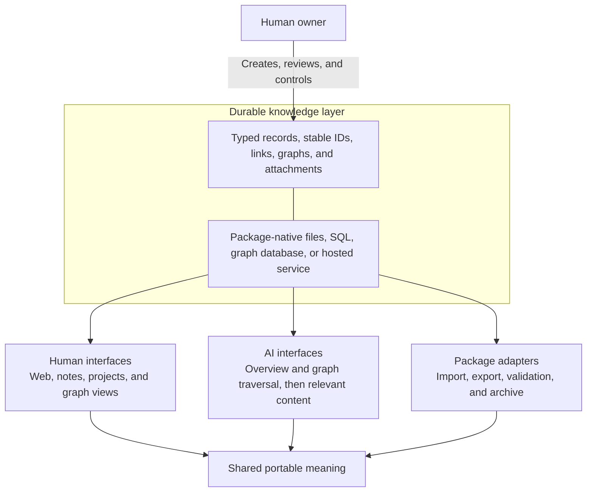

# Synthetic Engram Open Standard

**Manage knowledge once; keep it useful across people, applications, and AI.**
Synthetic Engram is a candidate open standard for durable, human-owned knowledge:
typed Markdown records, stable identities, explicit relationships, portable
graphs, and verifiable attachments. The same knowledge structure can support a
personal or organizational knowledge base, selective AI context, human-facing
tools, and migration between implementations.

> [!NOTE]
> **Status: Synthetic Engram Open Standard 1.0.0.** The normative schemas use
> permanent `v1.0` identifiers; published schema bytes are immutable.

## Purpose

Synthetic Engram is a **portable knowledge model and interchange standard**. It
defines durable objects and relationships that can form part of an application's
knowledge-management architecture, not only the format used when leaving that
application. Humans, conventional software, and AI-enabled tools can work from
the same defined structure without sharing a database, user interface, hosting
provider, or model runtime.

The standard is currently an emerging, maintainer-led specification with two
included cross-language implementations, not an established multi-vendor
industry standard. Adopt it first as an import/export boundary and evaluate it
with real round trips.

Core 1.0 standardizes the knowledge **as a portable package**. An implementation
may use that package as its live store, map the model into a database, or place an
API in front of it. Conformance does not require the live database or API to
match the package representation. Human ownership here means durable data
remains portable and inspectable; it does **not** mean the package grants or
enforces authentication, authorization, encryption, consent, or access
privileges.

## Where it fits



This supports three related uses:

- **Knowledge management:** keep notes, projects, actions, source material, and
  their relationships in a durable structure that can be inspected and evolved.
- **AI context:** let a chat service, coding agent, or local model first inspect
  manifests, record metadata, and graphs for a broad map, then request the
  specific record bodies and attachments relevant to its task. Stable IDs let
  derived answers retain citations back to durable source objects.
- **Human and application interoperability:** power web, desktop, graph, search,
  migration, backup, and archival experiences from implementations that preserve
  the same portable meaning.

The standard does not require every interface to read a directory package
directly. A knowledge service can expose application-specific HTTP, MCP, local
library, or other APIs over a conforming store. Core 1.0 does not standardize
those queries or transports, so package conformance alone does not make two live
services mutually queryable. If adopters demonstrate a shared need, a separate,
optional protocol binding could standardize operations such as capability
discovery, graph traversal, record retrieval by stable ID, bounded selection,
and partial-package delivery without fixing a retrieval or ranking algorithm.

## Why use it?

Most knowledge tools make their own storage model the boundary of what can be
kept, linked, or moved. A folder of Markdown is inspectable but does not by
itself define durable identity, typed records, graph semantics, package
completeness, or preservation rules. A database can provide those features but
usually binds them to one implementation.

Synthetic Engram defines the durable structure shared by **portable knowledge**
and the software that manages or uses it. Choose it when you want to:

- move a knowledge base between local files, SQL, graph databases, object
  storage, or hosted services without changing its portable meaning;
- manage a connected body of notes, projects, actions, graphs, and attachments
  without making one interface or runtime its only usable home;
- let human-facing tools, AI assistants, and coding agents consume the same
  durable objects without making any one of them authoritative;
- give an AI a compact structural overview before it retrieves larger source
  records, while retaining stable IDs for citation and follow-up requests;
- preserve IDs and relationships across renames, exports, and migrations;
- exchange a complete package or an explicitly partial package;
- validate what an export contains, including references and attachment hashes;
- allow partial implementations to declare exactly which profiles they support.

It is most likely to provide a net benefit when users need a credible exit path,
IDs and links must survive renames or migrations, multiple independently evolving
tools need the same durable objects, or complete and deliberately partial exports
must be distinguishable. It is more likely to be a burden when only one program
will ever read the data, plain Markdown is sufficient, or the real requirement is
live synchronization, collaborative history, authorization, semantic-web
reasoning, or an AI retrieval engine.

It is **not** a database engine, sync protocol, application framework, retrieval
algorithm, or AI-memory policy. It supplies the durable information model beneath
those concerns and a standard package for moving that knowledge between them.

## Who is it for?

- **Knowledge-base owners** who need an inspectable exit path from a product.
- **Knowledge-tool builders** who want a portable foundation for organizing and
  relating durable information while retaining freedom over storage and UX.
- **Application authors** who want a documented import/export contract rather
  than another proprietary backup format.
- **Agent and AI developers** who need durable, bounded context that remains
  useful outside a model runtime.
- **Adapter authors and coding agents** who need schemas, normative rules,
  fixtures, and observable conformance behavior to make implementation choices.

## Evaluate the standard

Choose the shortest path for your role:

- **Deciding whether to adopt:** read the
  [adoption guide](docs/adoption-guide.md), inspect the
  [complete example](examples/v1.0/basic-engram/README.md), and compare
  [related standards](docs/related-standards.md).
- **Building an exporter or importer:** read the
  [architecture](docs/architecture.md), then the [normative specification](SPEC.md)
  and [conformance checklist](docs/conformance.md).
- **Building an AI or retrieval integration:** read the
  [AI integration guide](docs/ai-integration.md), then implement only the profiles
  needed by the integration.
- **Reviewing or evolving the standard:** use the
  [implementation-feedback register](docs/development/implementation-feedback.md)
  and the [decision records](docs/decisions/README.md).
- **Using an agent to implement support:** provide `SPEC.md`, the applicable JSON
  Schemas, `docs/conformance.md`, and the relevant fixtures as authoritative
  context; rationale and guides are non-normative.

## Documentation map

- [Normative specification](SPEC.md)
- [Complete 1.0 example package](examples/v1.0/basic-engram/README.md)
- [JSON Schemas](schemas/README.md)
- [Conformance and validation](docs/conformance.md)
- [Language-neutral conformance harness protocol](docs/harness-protocol.md)
- [Design rationale](docs/rationale.md)
- [Architecture and implementation boundaries](docs/architecture.md)
- [Related standards and projects](docs/related-standards.md)
- [Adoption and implementation-cost guide](docs/adoption-guide.md)
- [AI and retrieval integration guide](docs/ai-integration.md)
- [Project and component maturity](docs/status.md)
- [Restricted front-matter grammar and parser contract](docs/front-matter.md)
- [Identity mapping and package lifecycle](docs/identity-lifecycle.md)
- [Remote delivery pattern](docs/remote-delivery-pattern.md)
- [Implementation-feedback register](docs/development/implementation-feedback.md)
- [Implementation plan for adoption feedback](docs/development/implementation-plan.md)
- [Adoption-feedback execution backlog](docs/development/implementation-backlog.md)
- [Non-normative design-decision matrix](docs/design-decisions.md)
- [Open design questions](docs/open-questions.md)
- [Authoritative 1.0 promotion checklist](docs/releases/1.0-checklist.md)

## Design principles

- **User authority:** knowledge remains under the defined owner's control.
- **Portability:** an export remains useful after its creating application is gone.
- **Partial consumption:** an implementation may support only declared profiles.
- **Stable identity:** links use durable IDs, not filenames or database keys.
- **Human inspection:** textual records use UTF-8 Markdown with YAML front matter.
- **Extensibility:** namespaced additions survive round trips without redefining core fields.
- **Storage independence:** live storage does not need to resemble an exported package.

## Package at a glance

```text
my-engram/
├── engram.json
├── records/
│   ├── notes/
│   ├── projects/
│   └── actions/
├── graphs/
└── attachments/
```

Every package has a JSON manifest. Records are Markdown files with a normative
YAML front matter envelope; graphs and attachment metadata are JSON. See
[`examples/v1.0/basic-engram`](examples/v1.0/basic-engram) for a small valid package.

## Validate the repository

Requires Python 3.11+ and the dependencies in `requirements-dev.txt`.

```sh
python -m pip install -r requirements-dev.txt
python scripts/validate.py
python scripts/run_frontmatter_tests.py
python scripts/run_lifecycle_tests.py
```

The validator checks schemas, identifiers, references, attachment hashes, and
the repository's valid and invalid conformance fixtures. The additional
development contracts differentially test restricted front matter and identity
lifecycle guidance in Python and Node.

## Contributing and licensing

See [CONTRIBUTING.md](CONTRIBUTING.md) and [GOVERNANCE.md](GOVERNANCE.md).
Specification prose is licensed under
[CC BY-SA 4.0](LICENSE); schemas, examples, and validation software are licensed
under [MPL 2.0](LICENSE-CODE). Both licenses permit commercial use while keeping
changes to the covered specification or source files open under their respective
terms; see the [plain-language licensing guide](docs/licensing.md).
